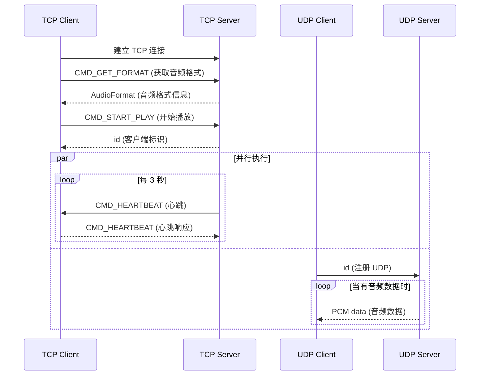

# Audio Share 项目分析报告

## 目录

1. [项目概述](#1-项目概述)
2. [项目架构](#2-项目架构)
3. [组件详细分析](#3-组件详细分析)
   - [3.1 Android 客户端应用](#31-android-客户端应用-android-app)
   - [3.2 跨平台命令行服务器](#32-跨平台命令行服务器-server-core)
   - [3.3 Windows MFC GUI 服务器](#33-windows-mfc-gui-服务器-server-mfc)
   - [3.4 Protocol Buffers 定义](#34-protocol-buffers-定义-protos)
4. [通信协议分析](#4-通信协议分析)
5. [技术栈分析](#5-技术栈分析)
6. [构建与部署](#6-构建与部署)
7. [版本管理](#7-版本管理)
8. [项目特性](#8-项目特性)
9. [总结与评价](#9-总结与评价)

---

## 1. 项目概述

### 1.1 基本信息

| 属性 | 值 |
|------|-----|
| 项目名称 | Audio Share |
| 当前版本 | 0.3.4 |
| 许可证 | Apache-2.0 |
| 作者 | mkckr0 |
| 项目地址 | https://github.com/mkckr0/audio-share |

### 1.2 核心功能

Audio Share 是一个**音频共享**工具，它可以将 Windows/Linux 计算机的音频通过网络传输到 Android 手机上播放。这意味着您的手机可以成为电脑的无线扬声器，无需购买额外的音箱设备。

### 1.3 运行环境要求

**服务端（PC）：**
- Windows 10+ x86_64（需要 Microsoft Visual C++ 2015-2022 Redistributable）
- Linux（需要 PipeWire 音频服务）
- 需要有可用的音频端点（声卡）

**客户端（手机）：**
- Android 6.0 (API 23) 或更高版本

**网络要求：**
- 手机与电脑在同一局域网内（Wi-Fi 或 USB 网络共享）

---

## 2. 项目架构

### 2.1 整体架构图

```
┌─────────────────────────────────────────────────────────────────┐
│                        Audio Share 系统                          │
├─────────────────────────────────────────────────────────────────┤
│                                                                   │
│  ┌───────────────────┐              ┌────────────────────────┐  │
│  │   服务端 (PC)      │              │   客户端 (Android)      │  │
│  │                   │              │                        │  │
│  │ ┌───────────────┐ │    TCP/UDP   │ ┌────────────────────┐ │  │
│  │ │ server-mfc    │ │◄────────────►│ │   android-app      │ │  │
│  │ │ (Windows GUI) │ │              │ │                    │ │  │
│  │ └───────────────┘ │              │ │  ┌──────────────┐  │ │  │
│  │        或         │              │ │  │  NetClient   │  │ │  │
│  │ ┌───────────────┐ │              │ │  ├──────────────┤  │ │  │
│  │ │ server-core   │ │              │ │  │ AudioPlayer  │  │ │  │
│  │ │ (跨平台 CMD)   │ │              │ │  ├──────────────┤  │ │  │
│  │ └───────────────┘ │              │ │  │ AudioTrack   │  │ │  │
│  │                   │              │ │  └──────────────┘  │ │  │
│  │ ┌───────────────┐ │              │ └────────────────────┘ │  │
│  │ │ Audio Manager │ │              │                        │  │
│  │ ├───────────────┤ │              └────────────────────────┘  │
│  │ │ Win32: WASAPI │ │                                          │
│  │ │ Linux: PipeWire│ │                                          │
│  │ └───────────────┘ │                                          │
│  └───────────────────┘                                          │
│                                                                   │
└─────────────────────────────────────────────────────────────────┘
```

### 2.2 目录结构

```
audio-share/
├── android-app/          # Android 客户端应用
│   ├── app/              # 应用主模块
│   │   ├── src/main/     # 主代码目录
│   │   │   ├── java/     # Kotlin/Java 源代码
│   │   │   └── res/      # Android 资源文件
│   │   └── build.gradle.kts
│   └── gradle/           # Gradle 配置
├── server-core/          # 跨平台 C++ 命令行服务器
│   ├── src/              # 源代码
│   │   ├── linux/        # Linux 特定实现
│   │   └── win32/        # Windows 特定实现
│   └── CMakeLists.txt    # CMake 构建配置
├── server-mfc/           # Windows MFC GUI 服务器
│   ├── audio-share-server/  # 主程序
│   └── unit-test/        # 单元测试
├── protos/               # Protocol Buffers 定义
│   └── client.proto      # 客户端通信协议
├── docs/                 # 文档目录
├── metadata/             # 应用商店元数据
│   └── en-US/            # 英文元数据
├── scripts/              # 脚本工具
├── VERSION               # 版本号文件
├── LICENSE               # 许可证文件
└── README.md             # 项目说明文档
```

---

## 3. 组件详细分析

### 3.1 Android 客户端应用 (android-app)

#### 3.1.1 技术栈

| 技术 | 说明 |
|------|------|
| 语言 | Kotlin |
| UI 框架 | Jetpack Compose |
| 最低 SDK | 23 (Android 6.0) |
| 目标 SDK | 35 |
| 网络库 | Ktor |
| 序列化 | Protocol Buffers (Lite) |
| 依赖注入 | 无（使用原生方式） |
| 导航 | Navigation Compose |
| 数据持久化 | DataStore Preferences |
| 媒体播放 | AndroidX Media3 |

#### 3.1.2 核心模块

**服务层 (`service/`)：**

| 文件 | 功能 |
|------|------|
| `AudioPlayer.kt` | 音频播放器实现，封装 AudioTrack API |
| `NetClient.kt` | 网络客户端，处理 TCP/UDP 通信 |
| `PlaybackService.kt` | 媒体播放服务，使用 Media3 Session |
| `QsTileService.kt` | 快速设置磁贴服务 |
| `BootReceiver.kt` | 开机启动广播接收器 |
| `BootService.kt` | 开机启动服务 |
| `NetworkIO.kt` | 网络 I/O 工具类 |

**UI 层 (`ui/`)：**
- `MainActivity.kt` - 主 Activity
- `base/` - 基础 UI 组件
- `screen/` - 各功能页面
- `theme/` - 主题配置

**数据层 (`model/`)：**
- 数据模型和配置存储

**工作线程 (`worker/`)：**
- 后台工作任务

#### 3.1.3 依赖库版本

```toml
# 主要依赖版本
kotlin = "2.0.21"
ktor = "3.0.1"
protobuf = "4.28.2"
compose-bom = "2024.10.01"
media3 = "1.5.0"
material-kolor = "2.0.0"
```

#### 3.1.4 构建配置

- 使用 Gradle Kotlin DSL
- 支持 R8 代码压缩和资源混淆
- 支持签名配置（release 构建）
- 生成 locale 配置（多语言支持）

---

### 3.2 跨平台命令行服务器 (server-core)

#### 3.2.1 技术栈

| 技术 | 说明 |
|------|------|
| 语言 | C++20 |
| 构建系统 | CMake 3.20+ |
| 包管理 | vcpkg |
| 异步 I/O | Asio (非 Boost) |
| 日志 | spdlog |
| 命令行解析 | cxxopts |
| 序列化 | Protocol Buffers |
| Windows 音频 | WASAPI (Windows Audio Session API) |
| Linux 音频 | PipeWire |

#### 3.2.2 核心架构

```cpp
// 主要类结构
class audio_manager      // 音频管理器（抽象层）
class network_manager    // 网络管理器（TCP/UDP 服务器）

// 平台特定实现
namespace detail {
    class audio_manager_impl  // 平台音频实现（Linux: PipeWire, Win32: WASAPI）
}
```

#### 3.2.3 模块说明

| 文件 | 功能 |
|------|------|
| `main.cpp` | 程序入口，命令行参数解析 |
| `audio_manager.hpp/cpp` | 音频管理器抽象层 |
| `network_manager.hpp/cpp` | 网络管理器，TCP/UDP 服务器实现 |
| `formatter.hpp` | 格式化工具 |
| `pre_asio.hpp` | Asio 预处理头文件 |
| `linux/audio_manager_impl.cpp` | Linux PipeWire 实现 |
| `win32/audio_manager_impl.cpp` | Windows WASAPI 实现 |

#### 3.2.4 命令行参数

```bash
as-cmd [选项]

选项:
  -h, --help           显示帮助信息
  -l, --list-endpoint  列出可用音频端点
  -b, --bind           服务器绑定地址 [host][:<port>]
  -e, --endpoint       指定音频端点 ID
  --encoding           指定采集编码格式 (f32/s8/s16/s24/s32)
  --list-encoding      列出可用编码格式
  --channels           指定采集声道数
  --sample-rate        指定采样率 (Hz)
  -V, --verbose        设置日志级别为 trace
  -v, --version        显示版本信息
```

#### 3.2.5 网络管理器功能

- **TCP 服务器**：处理客户端连接、格式协商、播放控制
- **UDP 服务器**：广播音频数据到所有活跃客户端
- **心跳机制**：每 3 秒发送心跳包，5 秒超时断开
- **协程支持**：使用 Asio 协程处理异步 I/O

#### 3.2.6 音频管理器功能

- **端点枚举**：列出系统可用音频输出设备
- **环回录制**：捕获系统音频输出（非麦克风录音）
- **格式转换**：支持多种 PCM 格式 (f32, s8, s16, s24, s32)

---

### 3.3 Windows MFC GUI 服务器 (server-mfc)

#### 3.3.1 技术栈

| 技术 | 说明 |
|------|------|
| 语言 | C++ |
| UI 框架 | MFC (Microsoft Foundation Classes) |
| IDE | Visual Studio 2022 |
| 包管理 | vcpkg |

#### 3.3.2 项目结构

```
server-mfc/
├── audio-share-server.sln       # VS 解决方案文件
├── audio-share-server/          # 主项目
│   ├── CMainDialog.h/cpp        # 主对话框
│   ├── CServerTabPanel.h/cpp    # 服务器标签页
│   ├── CAppSettingsTabPanel.h/cpp  # 设置标签页
│   ├── CAboutDialog.h/cpp       # 关于对话框
│   ├── CTabPanel.h/cpp          # 标签页基类
│   ├── AudioShareServer.h/cpp   # 应用程序类
│   ├── util.hpp/cpp             # 工具函数
│   ├── i18n/                    # 国际化
│   │   ├── strings.csv          # 字符串表
│   │   └── generate_rc.py       # RC 文件生成脚本
│   └── res/                     # 资源文件
└── unit-test/                   # 单元测试项目
```

#### 3.3.3 主要功能

- **图形界面**：标签式界面，易于操作
- **系统托盘**：支持最小化到系统托盘
- **气球通知**：状态变化时弹出通知
- **多语言支持**：通过 i18n 系统支持国际化
- **自动更新检查**：检测新版本并提示更新

#### 3.3.4 依赖库

```
vcpkg install asio protobuf spdlog[wchar] wil nlohmann-json
# triplet: x64-windows-static-md
```

---

### 3.4 Protocol Buffers 定义 (protos)

#### 3.4.1 消息定义

```protobuf
syntax = "proto3";

package io.github.mkckr0.audio_share_app.pb;

message AudioFormat {
   enum Encoding {
      ENCODING_INVALID = 0;
      ENCODING_PCM_FLOAT = 1;   // 32位浮点 PCM (小端)
      ENCODING_PCM_8BIT = 2;    // 8位整数 PCM
      ENCODING_PCM_16BIT = 3;   // 16位整数 PCM
      ENCODING_PCM_24BIT = 4;   // 24位整数 PCM
      ENCODING_PCM_32BIT = 5;   // 32位整数 PCM
   }

   Encoding encoding = 1;  // 编码格式
   int32 channels = 2;     // 声道数
   int32 sample_rate = 3;  // 采样率
}
```

#### 3.4.2 支持的音频格式

| 编码 | Android 常量 | 说明 |
|------|-------------|------|
| ENCODING_PCM_FLOAT | ENCODING_PCM_FLOAT | 32位浮点 |
| ENCODING_PCM_8BIT | ENCODING_PCM_8BIT | 8位无符号整数 |
| ENCODING_PCM_16BIT | ENCODING_PCM_16BIT | 16位有符号整数 |
| ENCODING_PCM_24BIT | ENCODING_PCM_24BIT_PACKED | 24位打包整数 |
| ENCODING_PCM_32BIT | ENCODING_PCM_32BIT | 32位有符号整数 |

---

## 4. 通信协议分析

### 4.1 协议流程图



### 4.2 命令定义

| 命令 | 值 | 方向 | 说明 |
|------|-----|------|------|
| CMD_NONE | 0 | - | 空命令 |
| CMD_GET_FORMAT | 1 | C→S, S→C | 获取音频格式 |
| CMD_START_PLAY | 2 | C→S, S→C | 开始播放 |
| CMD_HEARTBEAT | 3 | S→C, C→S | 心跳保活 |

### 4.3 数据传输

**TCP 通道：**
- 用于命令交互和控制信息
- 可靠传输，保证命令送达

**UDP 通道：**
- 用于实时音频数据传输
- 低延迟，允许少量丢包
- MTU 优化：最大分段大小 = 1492 - 20 - 8 = 1464 字节
- 数据按照 block_align 对齐，确保单个采样不被分割

### 4.4 心跳机制

- **发送间隔**：3 秒
- **超时时间**：5 秒
- **超时处理**：自动断开连接

---

## 5. 技术栈分析

### 5.1 编程语言

| 语言 | 组件 | 说明 |
|------|------|------|
| Kotlin | Android App | 现代 Android 开发首选语言 |
| C++20 | server-core | 跨平台高性能，使用最新标准特性 |
| C++ | server-mfc | Windows GUI 开发 |
| Protocol Buffers | 通信协议 | 跨语言序列化 |
| Shell Script | 构建脚本 | 自动化版本管理 |
| Python | i18n 工具 | 国际化资源生成 |

### 5.2 第三方库

| 库 | 用途 | 许可证 |
|----|------|--------|
| Asio | 异步 I/O | BSL-1.0 |
| Protocol Buffers | 序列化 | Apache-2.0 |
| spdlog | 日志记录 | MIT |
| cxxopts | 命令行解析 | MIT |
| nlohmann/json | JSON 处理 | MIT |
| WIL | Windows 辅助库 | MIT |
| PipeWire | Linux 音频 | LGPL |
| Ktor | Android 网络 | Apache-2.0 |
| MaterialKolor | Material 主题 | MIT |

### 5.3 构建工具

| 工具 | 组件 | 说明 |
|------|------|------|
| Gradle 8.x | Android App | Kotlin DSL 配置 |
| CMake 3.20+ | server-core | 跨平台构建 |
| Visual Studio 2022 | server-mfc | Windows 开发 |
| vcpkg | C++ 依赖 | 包管理器 |

---

## 6. 构建与部署

### 6.1 Android 应用构建

```bash
cd android-app
# 安装 JDK 17
./gradlew assembleRelease
# 输出: app/build/outputs/apk/release/
```

### 6.2 命令行服务器构建 (Linux)

```bash
cd server-core
# 安装依赖
vcpkg install asio protobuf spdlog cxxopts
# 配置
cmake --preset linux-Release
# 构建
cmake --build --preset linux-Release
# 输出: out/install/linux-Release/bin/as-cmd
```

### 6.3 命令行服务器构建 (Windows)

```bash
cd server-core
# 安装依赖
vcpkg install asio protobuf spdlog[wchar] wil cxxopts
# 配置
cmake --preset windows-Release
# 构建
cmake --build --preset windows-Release
```

### 6.4 MFC GUI 服务器构建

```bash
# 使用 Visual Studio 2022 打开 server-mfc/audio-share-server.sln
# 安装依赖
vcpkg install asio protobuf spdlog[wchar] wil nlohmann-json
# 构建 Release x64
```

---

## 7. 版本管理

### 7.1 版本文件

项目使用统一的版本文件 `VERSION`（当前版本：`0.3.4`）

### 7.2 版本同步脚本

`scripts/apply_version.sh` 脚本自动同步版本到各组件：

```bash
# 更新的文件：
# - android-app/app/build.gradle.kts (versionName, versionCode)
# - server-core/CMakeLists.txt (VERSION)
# - server-mfc/audio-share-server/AudioShareServer.rc (FILEVERSION, PRODUCTVERSION)
```

### 7.3 版本号规则

- **语义化版本**：`MAJOR.MINOR.PATCH`
- **Android versionCode**：递增整数（当前 3004）
- **Windows 文件版本**：`MAJOR.MINOR.PATCH.0`

---

## 8. 项目特性

### 8.1 核心特性

1. **无线音频传输**：通过 WiFi/USB 网络共享传输音频
2. **跨平台服务器**：支持 Windows 和 Linux
3. **多音频格式**：支持 5 种 PCM 编码格式
4. **低延迟**：使用 UDP 传输实时音频
5. **系统托盘**：Windows GUI 支持最小化到托盘
6. **快速设置**：Android 支持快速设置磁贴
7. **自动重连**：断线自动重连机制
8. **音量控制**：支持独立音量调节和响度增强

### 8.2 音频特性

- **采样率**：44100Hz, 48000Hz 等（取决于系统设置）
- **声道**：立体声/单声道
- **编码**：16位整数（最常用）、32位浮点等
- **响度增强**：最高 3000mB（约 30dB）

### 8.3 网络特性

- **默认端口**：65530 (TCP + UDP)
- **MTU 优化**：自动分割超过 MTU 的数据包
- **心跳保活**：3 秒心跳间隔
- **多客户端**：支持多设备同时播放

### 8.4 平台特定特性

**Windows：**
- WASAPI 环回录制（无需虚拟音频设备）
- 自动请求防火墙规则

**Linux：**
- PipeWire 支持（现代 Linux 音频）
- 支持创建虚拟音频端点

**Android：**
- Material Design 3 界面
- 动态颜色主题 (Android 12+)
- 媒体通知控制
- 锁屏控制

---

## 9. 总结与评价

### 9.1 项目优势

| 方面 | 评价 |
|------|------|
| **功能实用性** | ⭐⭐⭐⭐⭐ 解决了实际问题，手机变身电脑音箱 |
| **跨平台支持** | ⭐⭐⭐⭐⭐ 覆盖 Windows、Linux 和 Android |
| **代码质量** | ⭐⭐⭐⭐☆ 使用现代 C++20 和 Kotlin，结构清晰 |
| **技术选型** | ⭐⭐⭐⭐⭐ 使用成熟稳定的技术栈 |
| **用户体验** | ⭐⭐⭐⭐☆ GUI 和命令行双模式，适应不同用户 |
| **文档完善度** | ⭐⭐⭐⭐☆ README 详细，但缺少开发文档 |

### 9.2 架构亮点

1. **模块化设计**：服务器和客户端完全解耦
2. **平台抽象**：音频管理器使用平台特定实现
3. **协议简洁**：使用 Protocol Buffers 定义清晰协议
4. **异步架构**：服务器使用协程处理并发
5. **版本统一**：使用脚本自动同步各组件版本

### 9.3 可改进方向

1. **音频压缩**：当前传输未压缩 PCM，可考虑 Opus 编码减少带宽
2. **加密传输**：添加可选的 TLS/DTLS 加密
3. **服务发现**：添加 mDNS/Bonjour 自动发现服务器
4. **iOS 支持**：开发 iOS 客户端扩大用户群
5. **Web 客户端**：使用 WebRTC 开发浏览器客户端

### 9.4 适用场景

- 🎧 需要临时扬声器时使用手机代替
- 🎮 电脑游戏时通过无线耳机收听音频
- 🎬 观看视频时使用手机作为音频输出
- 🔇 电脑没有音箱时的应急方案
- 💻 会议室投屏时的音频输出

---

## 附录

### A. 相关链接

- GitHub: https://github.com/mkckr0/audio-share
- F-Droid: https://f-droid.org/packages/io.github.mkckr0.audio_share_app
- SourceForge: https://sourceforge.net/projects/audio-share

### B. 文件统计

| 组件 | 主要语言 | 大致代码行数 |
|------|---------|-------------|
| android-app | Kotlin | ~3000 |
| server-core | C++ | ~1500 |
| server-mfc | C++ | ~2000 |
| protos | Protocol Buffers | ~35 |

### C. 许可证

本项目采用 Apache-2.0 许可证，允许商业使用、修改和分发。

---

*报告生成日期：2026年1月1日*
